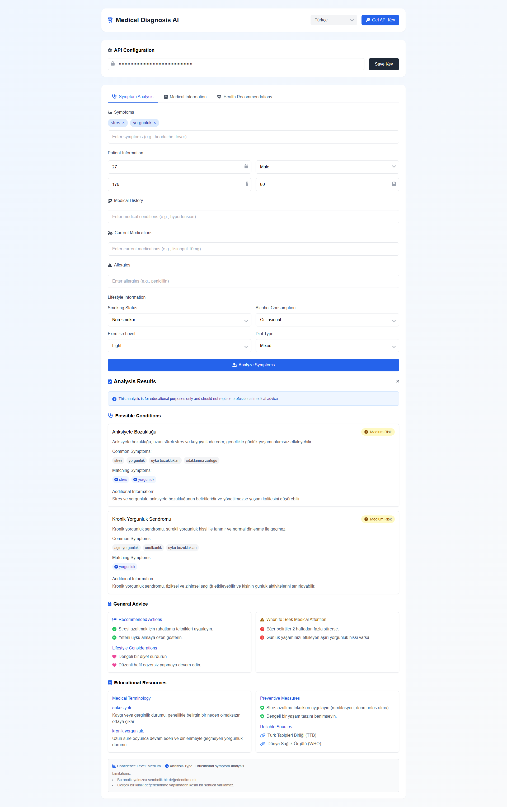

# AI Medical Diagnosis System

A modern web-based medical diagnosis system that uses AI to analyze symptoms and provide health recommendations. This application helps users get preliminary medical insights and health guidance.

## Features

- **Symptom Analysis**
  - Input multiple symptoms with an intuitive tag-based interface
  - Provide detailed patient information
  - Get AI-powered analysis of possible conditions

- **Medical Information**
  - Search for detailed information about medical conditions
  - Access educational resources and terminology
  - View common symptoms and treatments

- **Health Recommendations**
  - Receive personalized health advice
  - Track health goals and progress
  - Get lifestyle and preventive care recommendations

## Technical Features

- Modern, responsive UI built with TailwindCSS
- Real-time form validation
- Multi-language support
- State management with URL persistence
- Comprehensive error handling
- Interactive tag system for symptom input

## Getting Started

1. Clone the repository:
```bash
git clone https://github.com/smtkuo/ai-medical-diagnosis
cd ai-medical-diagnosis
```

2. Open `index.html` in your web browser or set up a local server:
```bash
# Using Python
python -m http.server 8000

# Using Node.js
npx serve
```

3. Get your API key:
   - Visit [RapidAPI - AI Medical Diagnosis API](https://rapidapi.com/bilgisamapi-api2/api/ai-medical-diagnosis-api-symptoms-to-results)
   - Sign up or log in to RapidAPI
   - Subscribe to the API to get your API key
   - Enter the API key in the application's configuration section

## Dependencies

- TailwindCSS - Utility-first CSS framework
- Font Awesome - Icon library
- ApexCharts - Interactive charts
- RapidAPI - Medical diagnosis API integration

## Browser Support

- Chrome (latest)
- Firefox (latest)
- Safari (latest)
- Edge (latest)

## Disclaimer

This application is for educational purposes only and should not replace professional medical advice. Always consult with a qualified healthcare provider for medical diagnosis and treatment. 